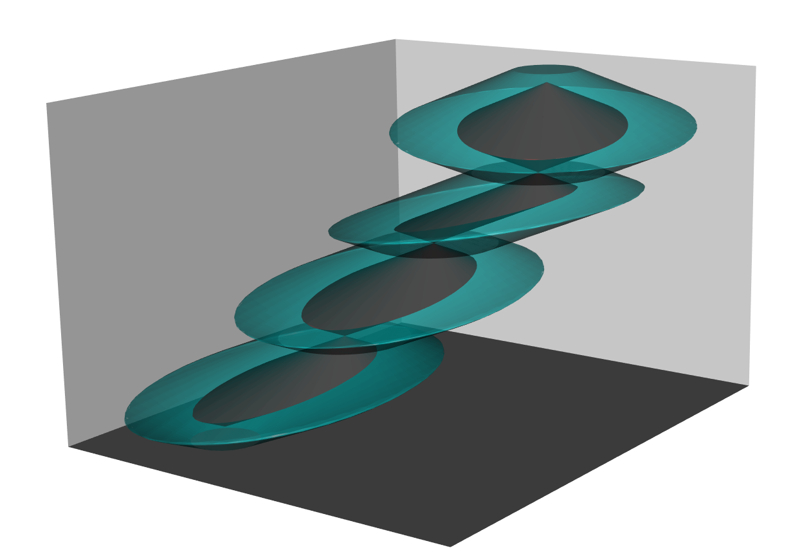

Overview
--------
Package that uses Space-Time Prism (STP) concept to analyse trajectories.
By incorparting the STP concept, users can analyse their data while taking into account 
the uncertainty of the location of an individual in between the control points of a trajectory.
The package also supports uncertainty about the control points themselves.  
The STPtrajectories package contains methods that calculate Potential Path Areas(PPAs),
create random  trajectories, calculate when an individual could have been at a spatial location, and test for possible encounters between two individuals by applying the alibi query.
It also provides a method that visulises STP trajectories in 3D.

 
Installation
------------

``` r

# the the development version from GitHub:
# install.packages("devtools")
devtools::install_github("markvregel/STPtrajectories",build_vignettes=TRUE)
# or without vignettes. vignette is rather large
devtools::install_github("markvregel/STPtrajectories")
```

Usage
-----

Creating a STP_Track

``` r
library(STPtrajectories)
library(spacetime)
library(sp)
#--------------------------create a STP_Track--------------------------
## create trajectory data
t1 <- as.POSIXct(strptime("01/01/2017 12:00:00", "%m/%d/%Y %H:%M:%S"))
t2 <- as.POSIXct(strptime("01/7/2017 12:00:00", "%m/%d/%Y %H:%M:%S"))
time <- seq(t1,t2,2*60*60)
n <- length(time)
x = cumsum(runif(n) * 8000)
y = smooth(cumsum(runif(n,-0.7,1) * 16000))

crs_NL = CRS("+init=epsg:28992")

points <- SpatialPoints(cbind(x,y),crs_NL)

temp <-18 + cumsum(runif(n,-0.3,0.25))
altitude <- 200 + cumsum(runif(n,-0.75,1)*50)

data <- data.frame(temperature = temp, elevation = altitude)

## create a STP_track
# create class STIDF
stidf1 = STIDF(points, time, data)

# Track-class {trajectories}
my_track1<-Track(stidf1)

# set maximum speed
v1<-10/3.6# speed 10 km/h = 2.777778 m/s

# STP_track class
STP_track1<-STP_Track(my_track1,v1)
```

Learning to use STPtrajectories
----------------

Getting help
------------
1. Check function help
2. Search in the manual: [STPtrajectories.pdf](https://github.com/markvregel/STPtrajectories/blob/master/STPtrajectories.pdf)
3. [Read the vignettes](http://htmlpreview.github.io/?https://raw.githubusercontent.com/markvregel/STPtrajectories/master/vignettes/STP_Tracks.html)

[Also look at the help of the trajectories package](https://cran.rstudio.com/web/packages/trajectories/index.html)
